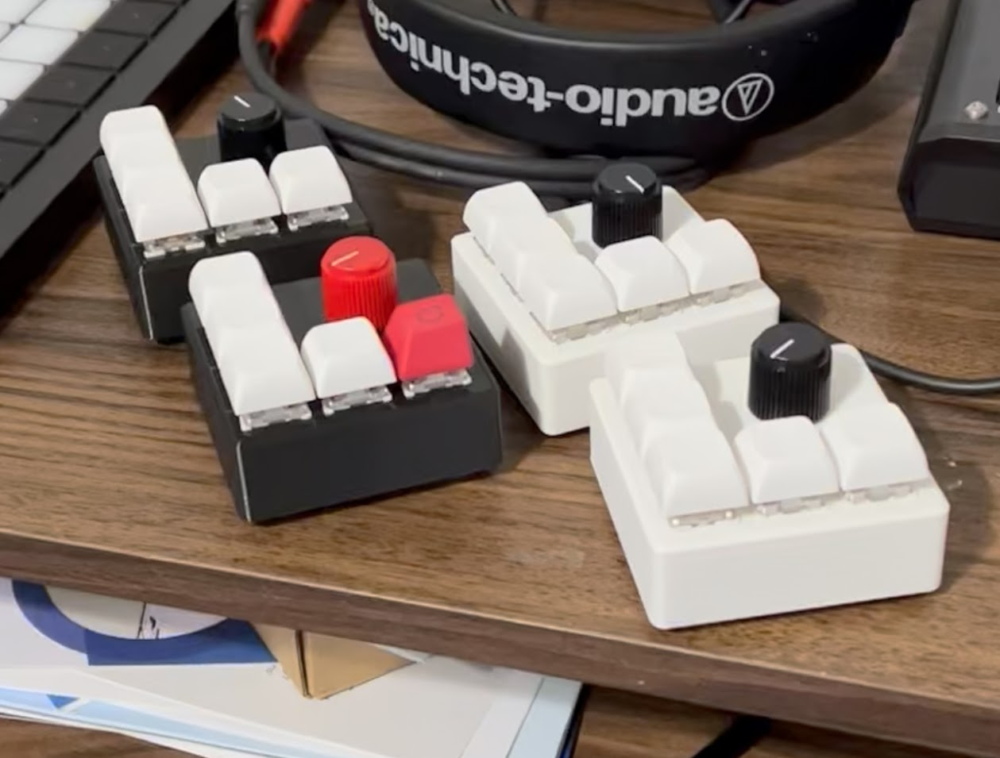

# giftMacropad
<i>Christmas 2022 gift</i>

For Christmas this year, I wanted to do something for my coworkers without spending too much cash. I had a Raspberry Pi Pico lying around, and was wondering if I could make a Macropad. Turns out it works pretty well! I was able to salvage some old Gateron Brown keyswitches from an old keyboard I had lying around. I drew up a design for the case in TinkerCAD so I could 3d print the enclosures. Since I had most of what I needed lying around, the only things I needed to buy were RaspPi Picos, USB cables, and keycaps. After printing and building, each one only cost around $8! The worst part was stripping the wires and hand-soldering the key switches. If I ever do this again, I’m going to design a PCB and order those.

For keymapping, I set the encoder up to control the system volume. Clicking the encoder mutes or unmutes. The keys are mapped to F5, F10, F11, and Ctrl-V to ease debugging their Matlab scripts. The final key send a Win-D combo that shows the desktop. Originally this was going to be a ctrl-alt-delete key, but I was not able to get the macropad to perform this task reliably, see issues below.

Issues: The Raspberry Pi Pico does not send keystrokes when the computer is locked or asleep, meaning the macropad cannot be used to wake up a computer. This is a problem, because I originally intended to have it send a ctrl+alt+del command to wake up our work computers from locked. Also, sending commands while the computer is locked causes the device to lock up and need to be rebooted, despite all keystroke being enclosed in “try-catch” blocks to prevent crashing that way.

 I will have to look deeper into the documentation and see if there is a way to keep the macropads active, and see what causes them to crash when used on a locked computer.
 
Future updates: It would be fun to add a little speaker so it could play sounds! Some LED displays would be nice to display a state such as Caps Lock or Mute, but I’m unsure how to query the Windows API to get this info so that the status LED would update if changed on the PC side. Also, I’d like to set up macro recording, but I think I’m reinventing the wheel. This task would be much easier on an Arduino Pro Micro running the Leonardo firmware, which allows it to be registered as an actual USB keyboard instead of a serial COM device/ flash drive like the RPi Pico. The goal was to make a cheap gift, which was received well by my coworkers.

